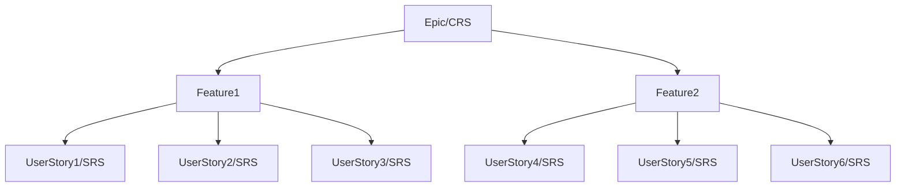

## 1. Tell Me about your self
> [https://github.com/SachinKn-notes/All-notes/blob/master/00_Personal-Questions.md](https://github.com/SachinKn-notes/All-notes/blob/master/00_Personal-Questions.md)

## 2. Tell Me about your Projects.
- Odysseus Solutions Pvt Ltd.
    1. Cruise Booking engine.
    2. Air Booking Engline.
    3. Hotel Booking Engine.
- Emertail Technologies Pvt Ltd.
    1. Smile Rent.  
    2. Sancy.

## 3. What is sprint.
`A sprint is a short, time-boxed iteration (typically 1-4 weeks) during which a specific set of tasks or features (user stories) are completed.`

## 4. What is Release.
`A release is a combination of multiple sprints and it is focused on delivering new version of product to users or stakeholders.`

## 5. What is Epic.
`It is a High level Documentation of a Customer Requirement Specification. (Epic is further derived to Features and Features are further derived to User Stories)`

## 6. What is User Story.
`Story is a detailed Software Requirement Specification for each and every individual module/feature.`



## 7. Strengths & Weaknesses.
- Strengths.
    - As a test engineer, I have a strong eye for detail, which helps me identify edge cases and potential bugs that others might miss. This skill ensures that the software is robust and high-quality.
    - I have Strong Knowledge in Automation Tools like Selenium & Playwright, which allows me to develop reusable, maintainable test scripts, reducing manual testing effort and improving test coverage.
    - I can quickly adapt to new environments and learn new tools efficiently.
- Weaknesses.
    - Sometimes I can get overly focused on small details, which may slow down the pace of testing. but, I am working on balancing this by setting time limits for tasks to stay on track and ensure timely delivery without compromising quality.

## 8. Flow of the status change from "in progress" to "ready to show case" in Sprint.
- **In Progress.**
    - **Task Assigned:** The task is assigned to a developer or team.
    - **Work Begins:** The team member starts working on the task. This could involve development, design, testing, or any required work.
    - **Daily Updates:** During the daily standups, progress is updated. If there are blockers, they are discussed.
- **Development Complete.**
    - **Code Complete:** Once the development work is finished, the developer marks the task as "Code Complete" or equivalent.
    - **Code Review:** The code is submitted for peer review. Feedback may lead to further changes or improvements.
    - **Unit Testing:** Automated or manual tests (like unit or integration tests) are conducted to ensure the feature works as intended.
- **Testing Phase.**
    - **QA Testing:** Once the development and code review are complete, the task moves to QA for testing.
        - Functional Testing: Ensures that the feature works according to the requirements.
        - Regression Testing: Verifies that existing functionality hasn’t been broken by the new changes.
    - **Bug Fixes:** If issues are found during testing, the task may go back to "In Progress" for fixes.
- **Ready for Showcase.**
    - **Passes QA:** After successful testing and no critical bugs, the task moves to "Ready for Showcase."
    - **Demo Preparation:** The team prepares the feature for a sprint demo or showcase to stakeholders.
        - This may involve updating documentation, preparing the environment, or making sure the feature is in a deployable state.
    - **Acceptance Criteria Met:** The product owner confirms that the task meets all acceptance criteria.
- **Showcase in Sprint Review.**
    - **Sprint Review:** The feature or story is showcased to stakeholders during the sprint review.
    - **Feedback:** Stakeholders give feedback, which could lead to new user stories or adjustments.
    - **Done:** If the feature is approved, it moves to Done, marking the end of the task in the sprint.

```
Note: stakeholders are
    1. Product Owner/Business Analysts
    2. Customers/Clients
    3. Investors/Board Members
    4. Project Manager
    5. Scrum Master
    6. Marketing and Sales Teams
    7. Executives and Senior Management
```

## 9. What is Spillover in a Sprint.
Spillover refers to tasks, user stories, or features that were planned for completion in a sprint but remain unfinished by the end of the sprint. These tasks typically need to be moved to the next sprint or reprioritized in future sprints.
- Spillover can occur for various reasons, including:
    - Underestimating the complexity or effort required for a task.
    - Inadequate capacity planning.
    - Changes in priorities during the sprint.

## 10. What to Do If Spillover Occurs in a Sprint
- Analyze the Root Cause
    - Capacity Planning: Review whether the team's velocity and capacity were estimated correctly at the beginning of the sprint.
    - Task Complexity: Determine if the tasks were more complex than originally estimated.
    - Blockers: Identify if there were external or internal blockers that caused delays.
    - Scope Creep: Check if additional tasks or changes to the task were introduced during the sprint.
- Discuss During Sprint Retrospective.
    - Use the sprint retrospective to discuss why the spillover occurred. Was it a one-time issue or part of a recurring pattern?
    - Focus on solutions to avoid similar situations in future sprints (e.g., better task breakdown, better estimation, removing blockers earlier).
- Reprioritize Tasks in the Backlog.
    - The Product Owner should reassess the remaining work and decide whether the incomplete tasks should be included in the next sprint based on the project's priorities.
    - Some tasks may lose priority and be moved down the backlog if they are no longer critical.
- Re-estimate the Spillover Work.
    - If the task was underestimated, adjust the estimate to better reflect the remaining effort required.
    - Ensure that tasks are properly broken down into manageable chunks.
- Carry Over to the Next Sprint.
    - If the task is still a priority, carry over the spillover work to the next sprint. It is essential to clearly communicate the expected scope to avoid repeating the same issue.
    - Ensure that the team's capacity in the next sprint accounts for the spillover work.
- Maintain Focus on Sprint Goals.
    - Even if spillover occurs, ensure the team focuses on the primary sprint goal. Not all tasks in a sprint backlog need to be completed as long as the sprint goal is achieved.

## 11. How to Minimize Spillover in Future Sprints.
- **Better Estimation:** Improve story point estimation by reviewing past sprints and making sure the team is aligned on how much work can be completed within a sprint.
- **Task Breakdown:** Break down user stories into smaller, more manageable tasks to ensure they can be completed within the sprint.
- **Identify Blockers Early:** Track potential blockers early and raise them in daily standups to prevent delays.
- **Flexibility:** Plan sprints with some flexibility for unexpected changes or challenges. Avoid overloading the sprint.
- **Focus on Prioritization:** Ensure the highest priority tasks are being worked on first so that lower-priority tasks are not causing spillover.

## 12. Roles of product owner(PO).
The Product Owner plays a crucial role in Agile and Scrum frameworks, acting as the bridge between the development team and stakeholders.
- Roles of PO are.
    - Requirement Gathering and creating Epics.
    - Create and Maintain the Backlog (Creating a User stories from Epics).
    - Prioritize User Stories.
    - Participation in Scrum Events like Sprint Planning, Sprint Review, Sprint Retrospective etc.
    - Release Planning.

## 13. If Requirements are frequently changing, how do you approach.
When requirement changes we need to update the test cases, and we need to revisit the test cases and then we need to execute the test cases. So We need to approach PO/PM and we need to tell them this is the challenge I'm facing, so we need to ask them, as of now can i test as per the new Requirement and update the tests later? Because the more sooner i find the bug the more quicker development team will fix the bug.

https://youtu.be/_A_Qg4Sqf3s?si=0BLA97CCdIcLuPJN


## 14. Test Strategy & Test Plan.
|Test Strategy|Test Plan|
|-------------|---------|
|It is a project-level document that sets the foundation for testing across the entire product development lifecycle.|It is a detailed, phase-specific document that helps execute the testing for a particular feature, release, or sprint.|
|Define standards and guidelines for testing activities, such as the tools, methodologies, and types of testing to be performed.|Provide a detailed view of the testing schedule, specific deliverables, resource requirements, and test cases.|
|It will be based on CRS/BRS document.|Test plan will be based on Test Strategy & SRS Document.|
|Rarely changes|Can change with each phase or sprint|


## 15. How you do test estimation or How you give story points(lets say 1 story point is equal to 8 hrs)
- Based on vertue of experience.
- Based on the project knowledge.
- Based on the complexity of the user story.
- Based on the Acceptance criteria of a story, whether I need to cover only functional or also I need to cover non-functional.
